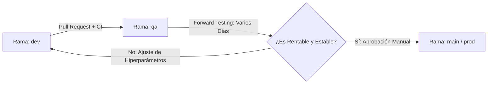

# Guía Operativa de GitHub y Protocolo de Forward Testing (QA ➡️ Prod)

Este documento define la arquitectura de control en GitHub, la estrategia de ramas y el **Protocolo Obligatorio de Validación Multi-Día en QA (Forward Testing)** requerido antes de autorizar cualquier despliegue con capital real en Binance Live (Fase 11).

---

## 🏗️ 1. Arquitectura de Ramas (GitFlow Estandarizado)

El repositorio utiliza un modelo de 3 ramas rígidamente asociadas a nuestros perfiles de Docker y variables de entorno:



1.  **Rama `dev` (Desarrollo Continuo y Reentrenamiento)**:
    *   **Propósito**: Experimentación de variables técnicas (`technical_indicators.py`), calibración de Optuna y desarrollo de nuevas señales.
    *   **Entorno / Docker**: `docker-compose.dev.yml` con `.env.dev`.
2.  **Rama `qa` (Staging y Forward Testing en Tiempo Real)**:
    *   **Propósito**: Ejecución empírica en tiempo real con datos de mercado en vivo (*Paper Trading* o *Testnet*) y monitoreo en el canal de Telegram QA. **Aquí es donde se realizan los días de prueba obligatorios.**
    *   **Entorno / Docker**: `docker-compose.qa.yml` con `.env.qa`.
3.  **Rama `main` (Producción Live - Protegida y Bloqueada)**:
    *   **Propósito**: Operatoria exclusiva con capital real en el VPS 2 dedicado.
    *   **Entorno / Docker**: `docker-compose.prod.yml` con `.env.prod`.

---

## 🔐 2. Configuración de Entornos y Reglas de Protección en GitHub.com

Para evitar errores humanos o puestas en producción prematuras sin haber comprobado la rentabilidad en QA, debes aplicar las siguientes reglas en la interfaz web de GitHub:

### A. Configurar Protección de Ramas (Branch Protection Rules)
En tu repositorio en GitHub: ve a **Settings ➡️ Branches ➡️ Add branch protection rule**:
*   **Branch name pattern**: `main`
*   Marcar ☑️ **Require a pull request before merging**.
*   Marcar ☑️ **Require status checks to pass before merging**:
    *   Seleccionar `test-and-validate` (de nuestro workflow `ci-gatekeeper.yml`).
    *   Seleccionar `docker-validation` (de nuestro workflow `docker-build.yml`).
*   Marcar ☑️ **Do not allow bypass the above settings**.

### B. Configurar Entornos Nativos y Aprobación Manual (GitHub Environments)
En tu repositorio en GitHub: ve a **Settings ➡️ Environments ➡️ New environment**:

1.  **Entorno `qa`**:
    *   **Environment secrets** (opcional para CI): Guardar `TELEGRAM_BOT_TOKEN_QA` y `TELEGRAM_CHAT_ID_QA`.
2.  **Entorno `production` (EL SEGURO DE VIDA)**:
    *   Marcar ☑️ **Required reviewers**: Añadir tu usuario de GitHub.
    *   *Nota*: Gracias a esta regla, incluso si un Pull Request pasa el 100% de los tests automáticos, GitHub bloqueará cualquier intento de fusión o despliegue a la rama `main` hasta que tú revises los logs de Telegram y apruebes manualmente el paso a producción.

---

## ⏳ 3. Protocolo de Testeo Multi-Día en QA (El Paso Previo a Producción)

Tal como establecimos en las reglas operativas, **queda estrictamente prohibido pasar a Producción Live sin haber acumulado varios días de evidencia empírica en el entorno de Staging (QA)**.

### Pasos para Ejecutar la Prueba Multi-Día (En tu próxima sesión):
1.  **Despliegue en VPS 1 (Entorno QA)**:
    Conéctate a tu servidor VPS 1 y ejecuta el contenedor en modo QA:
    ```bash
    git checkout qa
    git pull origin qa
    docker compose -f docker-compose.qa.yml up -d --build
    ```
2.  **Monitoreo en Tiempo Real vía Telegram**:
    El contenedor ejecutará el motor de Paper Trading (`scripts/run_paper_trading.py`) conectado a los WebSockets/REST de Binance en tiempo real. Todas las señales generadas $[-1.0, +1.0]$, aperturas de órdenes Bracket (TP/SL) y cierres se notificarán en tu grupo de **Telegram QA**.
3.  **Criterios de Aceptación para Dar el Salto a Producción (`main`)**:
    Al finalizar el período de evaluación continua (ej. 3 a 7 días de mercado activo), deberás verificar en el resumen financiero del bot:
    *   📈 **Rentabilidad Neta Positiva**: El balance de Paper Trading debe ser superior al capital inicial tras deducir el **Maker Fee del 0.020%**.
    *   🛡️ **Control de Drawdown**: El Max Drawdown experimentado durante los días de prueba no debe haber vulnerado el umbral del **15.00%**.
    *   ⚖️ **Consistencia del Modelo**: Ausencia de errores de desconexión no recuperables o violaciones de escalado.

### Autorización Final:
Solo tras validar estos números empíricos en Telegram, autorizarás en GitHub la fusión de `qa` hacia `main` e iniciaremos el despliegue en el **VPS 2 (Producción Live)**.
